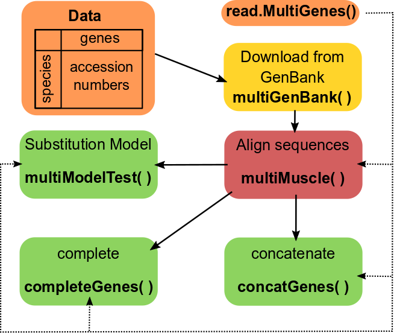

# alignTools: easy download and manage GenBank data, and alignments for phylogenetics </br>
**Author:** Omar Daniel Leon-Alvarado, leon.alvarado12@gmail.com
***
## **Installation**
```{r}
library(devtools)
install_github("oleon12/alignTools")
```
***
<p align=center>

<p class="caption" align=center>
Figure 1. alignTools workflow.</p>
</p>
<br>

***
## **Data**
To download multiple genes from GenBank, we need a data frame or matrix. Basically this data frame is a CSV file from a spreadsheets. The first column of this file is the species names or identifiers, and the other columns are the genes and their accession numbers. So, this is the "hard" step, you need to find each accession number. When a species have not information for a gene, you fill it as NA. See the Procyonidae data. Please, be careful when copying the accession number from GenBank, spaces may generate errors. So, before read your CSV file, check it in a text editor. These are examples of spaces generated " KU253485", "KU253485 ", " KU253485 ". If you can not see anything strange with the examples, the easy way is to press Crtl+F in your text editor and press spacebar. 
```{r}
#Procyonidae data
library(alignTools)
data(Procyonidae)
head(Procyonidae, 5L)

#Alternative for your data
data <- read.csv("Your_Data_Name.csv", header=T)
head(data, 5L)
```
***
## **multiGenBank( )**  
With this function, we will download the three genes for all species in Procyonidae. This function have two important parameters: 1. with.na: When you have NA in your data, you set it TRUE; 2. write.dna: If you want to save the files for each gene, you set it TRUE. The file will be saved in "fasta" format and the name will be the same as in the columns. The result is a list object with 3 DNAbin objects. See that each DNAbin object have a name, this name is the same as the column name. 
```{r}
genes <- multiGenBank(x = Procyonidae, with.na = TRUE, write.dna = FALSE)
#Check genes, a list object
str(genes)
genes$cytb
```
***
## **multiMuscle( )**
Now the next step is to align our sequences. For this we will use multiMuscle(), this function will align the sequences of each gene. The input file must be a list object. Now, only the MUSCLE algorithm is available, in future I will update for others like Clustal or tcoffe. The result is practically the same list object, but each gene aligned. Like multiGenBank(), this function can save each alignment in separate files, to do, just set write.dna=TRUE and select one of the available formats: "nexus" (default), "phylip", "fasta" or "tnt".
```{r}
alignment <- multiMuscle(x = genes, write.dna = FALSE)
#check alignment, a list object
str(alignment)
alignment$coi
```
***
## **concatGenes( )**
Most softwares (e.g. MrBayes, RaxML, PhyML) require a single file of concatenated genes. With concatGenes() we will achieve this task. It is common that one or more species have not information for one o more genes, so, when concatenate, we need to fill this absence. With concantGenes() we have two options: "?", or "-", by default "?". Also, we can save the concatenated file, just set write.dna=TRUE, select one format: "nexus" (default), "phylip", "fasta" or "tnt", and a filename. Very important, we can only concatenate aligned sequences. 
```{r}
concat <- concatGenes(Genes = alignment, missing = "?", write.dna = FALSE)
#Check concat, a DNAbin object
concat
```
***
## **completeGenes( )**
Same parameters as concatGenes(). Some softwares (e.g. RevBayes or PhyML) for partitioned analysis, require each gene in separate files, but all genes must have the same number of species. With completeGenes() we can create those files with the same number of species. For species without information in a specific gene, the function will use "?" (default) or "-". The result is a list object with DNAbin objects, all of them with the same number of species. Also, we can save the concatenated file, just set write.dna=TRUE, and select one format: "nexus" (default), "phylip", "fasta" or "tnt". Very important, we can only use aligned sequences. 
```{r}
complete <- completeGenes(genes = alignment, missing = "?", write.dna = FALSE)
#Check complete, a list object
str(complete)
complete$rag2
```
***
## **multiModelTest( )**
This function is an extension of the modelTest() function from phangorn. So, detailed information can be found with _help(modelTest)_. This function only works with aligned sequences. The results is a list object of length three. 1. summary.results: is a summary table with the best models for each gene with each estimator (AIC, AICc, AICw, AICcw and BIC), 2. results: The complete results of ModelTest(), and 3. warnings: sometimes, a gene could have two models, when that happend, a * symbol will be in the summary table, and the details will be saved in warnings.
```{r}
models <- multiModelTest(genes = alignment, G = TRUE, I = TRUE)
#Check models, a list object
models$warnings
models$results$cytb
```
***
## **read.multiGenes( )**
If you already have your own data, and want to use some functions from this package (e.g. concatGenes() or multiMuscle()), you can read your files using read.multiGenes(), this function will create the appropiate list object with DNAbin objects. Remember that the files must be the in the same working directory (setwd()). If you want to set specific names to each file, use the "names" parameter, but be careful, the names order had to be the same files order. The function can read three formats: "nexus", "phylip" or "fasta".
```{r}
files <- c("data1.nex","data2.nex","data3.nex","data4.nex")
#No names
data <- read.multiGenes(files = files, format = "nexus")
str(data)
data$data4.nex
#With names
data <- read.multiGenes(files = files, format = "nexus", names = c("gene1","gene2","gene3","gene4"))
str(data)
data$gene3
#Other way to set names
data <- read.multiGenes(files = files, format = "nexus")
names(data) <- c("my_name1","my_name2","my_name3","my_name4")
```
***
## **partitionScheme( )**
When we concatenate some genes, a partition scheme is created. This shows the genes order, and the position of each gene within the alignment. If we forgot this information, using partitionScheme() and the alignment, we can recover it. This could help you to set the partitions in the software (e.g. MrBayes, RaxML). 
```{r}
concat <- concatGenes(Genes = alignment, missing = "?", write.dna = FALSE)
#Check partition scheme
partitionScheme(alignment)
```
***
## **Pipelines** <br>
Pipeline 1: Common concatenate file. (works for MrBayes, PhyML, RAxML and many others)
```{r}
library(dplyr)
library(alignTools)

#Nexus
multiGenBank(Procyonidae,TRUE,FALSE)%>%
multiMuscle(write.dna = FALSE)%>%
concatGenes(missing = "?", write.dna = TRUE, write.format = "nexus", filename = "concat")

#Phylip
multiGenBank(Procyonidae,TRUE,FALSE)%>%
multiMuscle(write.dna = FALSE)%>%
concatGenes(missing = "?", write.dna = TRUE, write.format = "phylip", filename = "concat")
```
***
Pipeline 2: Partitioned analysis with separate files (works for RevBayes and PhyML)
```{r}
library(dplyr)
library(alignTools)

#Nexus
multiGenBank(Procyonidae, TRUE, FALSE)%>%
multiMuscle(write.dna = FALSE)%>%
completeGenes(missing = "?", write.dna = TRUE, write.format = "nexus")

#Phylip
multiGenBank(Procyonidae, TRUE, FALSE)%>%
multiMuscle(write.dna = FALSE)%>%
completeGenes(missing = "?", write.dna = TRUE, write.format = "phylip")
``````
